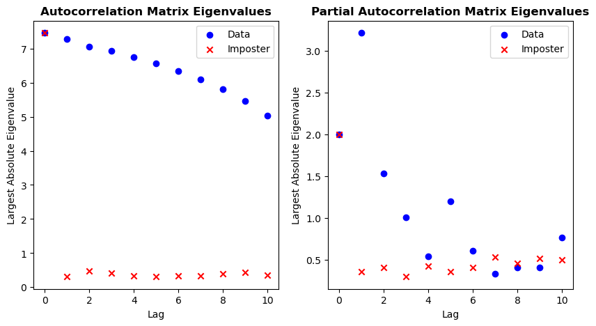

dPCA
================

<!-- WARNING: THIS FILE WAS AUTOGENERATED! DO NOT EDIT! -->

## Install

``` sh
pip install dynamicPCA
```

Visit the [homepage](https://waterboy96.github.io/dPCA/) for
documentation and example usecases.

## How to use

``` python
from dPCA.TEP import *
from dPCA.analysis import *
```

``` python
TEP = GetTEP()
```

``` python
analysis = Analysis(TEP,10)
```

``` python
analysis.show_plots()
```


